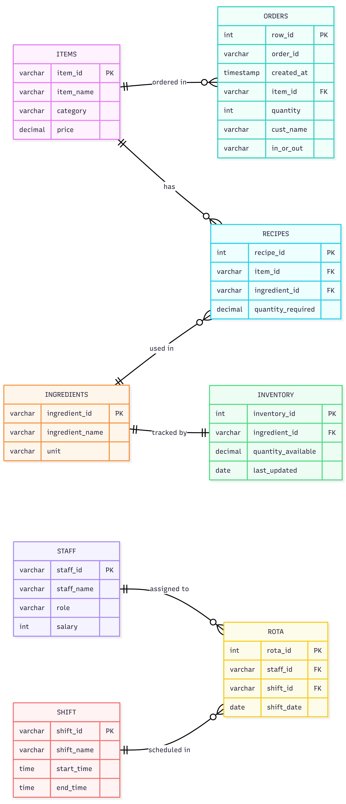

# **☕ Coffee Shop Management System | SQL Project**

# 📌 Overview

The **Coffee Shop Management System** is a relational database project built using **MySQL** to manage and optimize daily café operations.

This project simulates real-world business scenarios such as:

* Customer order management
* Menu & pricing system
* Recipe and ingredient mapping
* Inventory tracking
* Staff scheduling and shift management

---

## 🎯 Objectives

* Design a **normalized database (3NF)**
* Maintain **data integrity** using Primary & Foreign Keys
* Perform **advanced SQL queries** for business insights
* Model real-world **transactional workflows**

---

## 🏗️ Database Architecture

| Table       | Description                  |
| ----------- | ---------------------------- |
| Items       | Stores menu items and prices |
| Orders      | Manages customer orders      |
| Recipes     | Maps items to ingredients    |
| Ingredients | Stores raw materials         |
| Inventory   | Tracks stock levels          |
| Staff       | Employee details             |
| Shift       | Shift timings                |
| Rota        | Staff scheduling             |

---

## 🖼️ ER Diagram



---

## 🛠️ Tech Stack

* MySQL
* SQL
* ER Modeling
* Database Normalization (3NF)

---

## 📊 SQL Concepts Used

* Joins (INNER JOIN, etc.)
* Aggregations (`SUM`, `COUNT`)
* Subqueries
* Window Functions (`RANK()`)
* CTE (Common Table Expressions)
* Views

---

## 📈 Business Insights Generated

* 📊 Total sales per item
* 🥇 Best-selling products
* ⏱️ Hour-wise order trends
* 📦 Inventory consumption analysis
* 👨‍💼 Staff shift utilization

---

## 📂 Project Structure

```
coffee-shop-management-sql/
│── schema.sql          # Database & table creation
│── data.sql            # Insert sample data
│── queries.sql         # Analytical SQL queries
│── ER_Diagram.png      # ER diagram
│── project-report.pdf  # Full documentation
│── README.md
```

---

## ▶️ How to Run

1. Run `schema.sql` to create database and tables
2. Run `data.sql` to insert sample data
3. Run `queries.sql` to execute analysis

---

## 🚀 Key Highlights

* Fully normalized relational database
* Real-world business implementation
* Clean and scalable schema design
* Advanced SQL query usage

---

## 🔮 Future Enhancements

* Add triggers for automation
* Build dashboards (Power BI / Tableau)
* Convert into full-stack application (API + UI)
* Add stored procedures

---

## 👨‍💻 Author

**Nitish Giri**

---

⭐ If you found this project useful, consider giving it a star!
